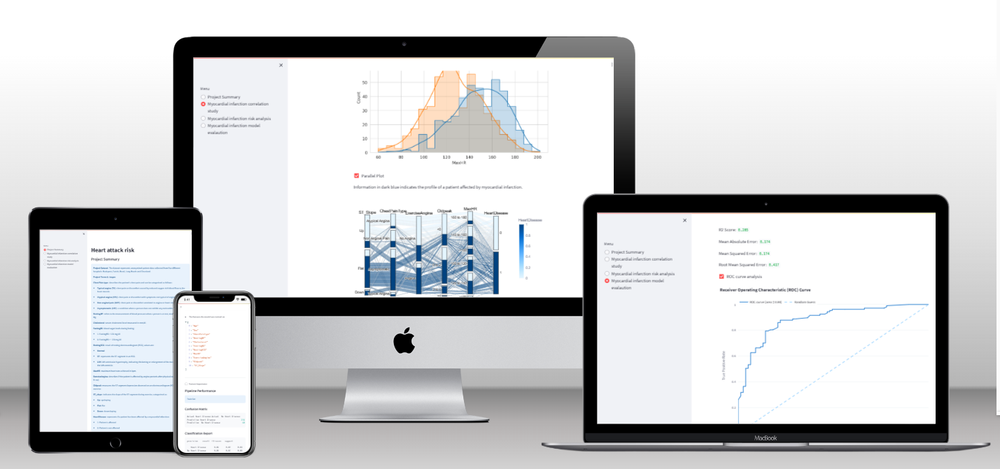
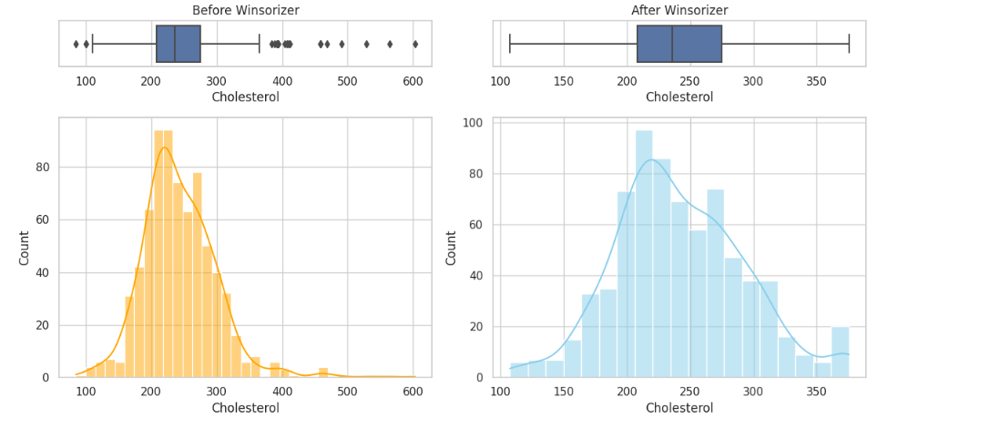
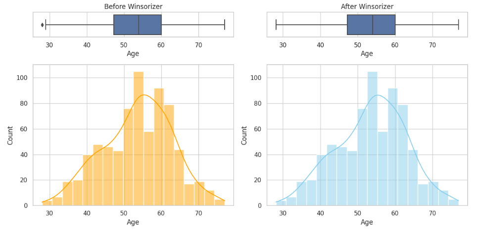
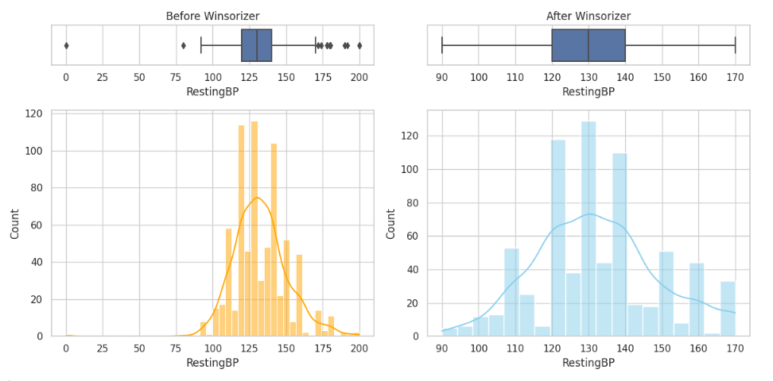
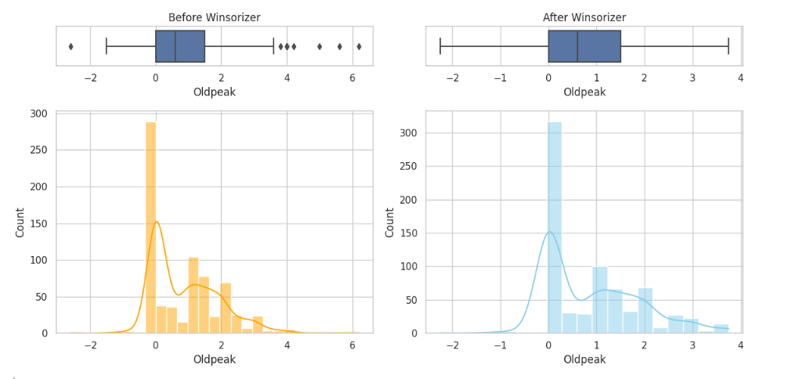

### Myocardial Infarction Risk Analysis
---
In an era marked by the increasing prevalence of cardiovascular diseases (CVDs), understanding the factors contributing to heart health and risk has become paramount. Cardiovascular diseases, encompassing conditions such as coronary artery disease, stroke, and hypertension, remain the leading cause of mortality worldwide. With lifestyle choices, genetic predispositions, and environmental factors interplaying in complex ways, the need for precise risk assessment models becomes evident.

This heart risk analysis project aims to delve into the intricate web of variables influencing cardiovascular health, employing advanced statistical techniques and machine learning algorithms. By analyzing vast datasets of anonymized patient data gathered from five different hospitals in Budapest, Zurich, Basel, Long Beach, and Cleveland, I aim to infer which variables from the dataset correlate most strongly with a high risk of myocardial infarction.

The primary objective is to provide a method capable of predicting, with at least 80% precision, which patients are at high risk. Subsequently, healthcare practitioners can proactively reach out to patients identified as high risk, offering them preventive therapies and interventions.

Live link to [Myocardial Infarction Risk Analysis](https://heart-attack-risk-10ddd79e68a6.herokuapp.com/)


---
## Table of contents
---
- [Introduction](#heart-risk-analysis)
- [Dataset](#dataset)
- [Business requirements](#business-requirements)
- [Hypothesys](#Hypothesis)
- [Agile development](#agile-developmemt)
- [Future developments](#future-developments)
- [ML model development](#ml-model-development)
    - [Data Cleaning and Feature Engeenering](#data-cleaning-and-feature-engeenering)
    - [ML pipeline](#ml-pipeline)
    - [ML pipeline evaluation](#ml-pipeline-evaluation)
- [Neural network](#neural-network)
    - [Data preparation](#data-preparation)
    - [Neural network model](#neural-network-model)
    - [Neural network evaluation](#neural-network-evaluation)
- [Correlation study](#correlation-study)
- [Dashboard design](#dashboard-design)
- [Testing](#testing)
    - [Bug and Fixes](#bugs-and-fixes)
    - [Manual Testing](#manual-testing)
    - [Validators](#validators)
        - [Python](#python)
- [Deployment](#deployment)
- [Packages & Technologies](#packages--technologies)
- [Credits](#credits)

---
## Dataset

The dataset I used in this project is publicly available on [Kaggle](https://www.kaggle.com/) and can be downloaded and inspected here: [Heart failure dataset](https://www.kaggle.com/datasets/fedesoriano/heart-failure-prediction).

The dataset contains anonymized patient data collected from five different hospitals in Budapest, Zurich, Basel, Long Beach and Cleveland :
 - Cleveland: 303 observation
 - Budapest: 294 observations
 - Zurich: 123 observations
 - Long Beach: 200 observations
 - Basel: 270 observations

The dataset contains the following features:
- **Age**: Refers to the age of the patient

- **Sex**: Refers to the biological sex of the patient M for male, F for female

- **Chest Pain type**: Describes the patient's chest pain and can be categorized as follows:
        - **Typical angina (TA)**: Chest pain or discomfort caused by reduced oxygen-rich blood flow to the heart muscle.
        - **Atypical angina (ATA)**: Chest pain or discomfort with symptoms not typical of angina pectoris.
        - **Non-anginal pain (NAP)**: Chest pain or discomfort unrelated to angina or heart-related issues.
        - **Asymptomatic (ASY)**: A condition where a person does not exhibit any noticeable symptoms.

- **RestingBP**: Refers to the measurement of blood pressure when a person is at rest, measured in mm Hg.

- **Cholesterol**: Serum cholesterol level measured in mm/dl.

- **FastingBS**: Blood sugar levels during fasting:
    - 1: FastingBS > 120 mg/dl
    - 0: FastingBS <= 120 mg/dl

- **RestingECG**: Result of resting electrocardiogram (ECG), with values: 
    - **Normal**
    - **ST**: Represents the ST segment in an ECG.
    - **LVH**: Left ventricular hypertrophy, indicating thickening or enlargement of the muscular wall of the left ventricle.

- **MaxHR**: Maximum heart rate achieved in bpm.

- **ExerciseAngina**: Indicates if the patient is affected by angina pectoris after physical exercise (Y: yes, N: no

- **Oldpeak**: Measures the ST segment depression observed on an electrocardiogram (ECG) during exercise.

- **ST_slope**: Indicates the slope of the ST segment during exercise, categorized as:
    - **Up**: Upsloping
    - **Flat**: Flat
    - **Down**: Downsloping

The targer variable is :
- **HeartDisease**: Indicates if a patient is at high risk of myocardial infarction:
    - 1: High risk
    - 0: Low risk
 
---

## Business Requirements
The first business requirement is to identify which variables most strongly correlate with a high risk of myocardial infarction.

The second business requirement is to predict with at least 80% precision which patients are at high risk of having a myocardial infarction.

Phisicians will reach out to patients identified as at high risk and provide ad hoc therapies where necessary.

Key Stakeholders are : Physicians, Medical Practice, Hospitals and healthcare facilities.

Thus, the requirements are the following:
 - **Accessibility** : The tool developed will be used by physicians with no experience in coding; therefore, the interface must be accessible.

 - **Privacy**: Sensitive patient data must not be tracked, including names, last names, and email addresses.

- **Speed**: The physician should be able to add patient data and get results quickly.

- **Precision**: The method must have a precision of at least 80% to ensure that only patients at high risk of myocardial infarction are reached out to. Therefore, false positives and false negatives should be minimized.

----
## Hypothesis

In this project, the null hypothesis (H0) is the following: The database features cannot predict a high risk of myocardial infarction. The alternative hypothesis (H1) is: The database features can predict a high risk of myocardial infarction.

1. In order to predict if a patient is at high risk of myocardial infarction, I created an ML pipeline.

1. To evaluate the performance of the pipeline, the project includes a table of truth showing that precision is ≥ 80% on both the test and train sets.

1. I used Spearman, Pearson, and Predictive Power Score (PPS) to identify the variables that correlate the most. This allows for further research to determine if there is any biological reason to explain the correlations found.

1. Correlation and ML performance are shown through plots to make the performance and correlations clearly visible.

---

## Agile developmemt

For this project, I adopted an Agile approach. The project was divided into three sprints, and the user stories were labeled using the MoSCoW method. Below, I list the user stories grouped by sprint:

- Sprint 1 15/04/2024 - 29/04/2024
    - As a **Developer** I can **import the data into Jupiter Notebook** so that **I can process the dataset**.
    - As a **Developer** I can **have an overview of the dataset** so that **I can see features and target distributions and histograms**.
    - As a **Developer** I can **understand which variable correlates the most with myocardial infarction** so that **I can meet one of the business requirements**.
    - As a **Developer** I can **check if there are missing data in the dataset** so that **I can handle them**.

- Sprint 2 29/04/2024 - 13/05/2024
    - As a **Developer** I can **have a dataset containing engineered features** so that **ML pipeline can be applied**.
    - As a **Developer** I can **run an ML pipeline** so that **I can predict myocardial infarction**.
    - As a **Developer** I can **assess the ML pipeline** so that **I can improve the model if business requirements are not met**.
    - As a **User** I can **visualize Streamlet's first page** so that **I can have an overview of the project aim and jargon**.
    - As a **Developer** I can **deploy my project on Heroku** so that **Users can visualize it and provide feedback**.
    - As a **User** I can **visualize the correlation page on Streamlit** so that **I can understand which features correlate the most with myocardial infarction risk**.
    - As a **User** I can **Insert patient data** so that **I can verify if the patient is at high risk of myocardial infarction**.
    - As a **User** I can **visualize pipeline performances** so that **I can evaluate if pipeline outputs can be trusted**.

- Sprint 3 13/05/2024 - 27/05/2024
    - As a **User** I can **get details of the project and ML pipeline implementation** so that **I can decide if to adopt it or not**
    - As a **Developer** I can **compare the regular ML approach to a neural network approach** so that **I can understand which one performs better**

-----

## Future developments

Future development includes :

 - Develop an API system to automate the risk evaluation
 - Create a models using Features available to patients and not only to practioners
 - Create a models using Features available on Smartwatch, so that smarwatches can send a notifcation if there is an high risk of myocardial infarction

---
## ML model development

The ML model I implemented consists of two pipelines: one for data cleaning and feature engineering, and the second for feature selection and model building.

### Data Cleaning and Feature Engeenering

The data cleaning and feature engineering pipeline consists of the following steps: RandomSampleImputer, OrdinalCategoricalEncoder, and Winsorizer.

**RandomSampleInputer**. None of the features in the dataset had missing values. However, upon inspection, I noticed that approximately 20% of the values for the cholesterol feature were zeros.


Therefore, I used the RandomSampleImputer to redistribute the data uniformly across the distribution. After applying the RandomSampleImputer, I obtained the following distribution:


**OridnalCategoricalEncoder**.  I used the OrdinalCategoricalEncoder to convert all the features of type object into numerical features. The object-type features are:
**Sex**, **ChestPainType**,**RestingECG**, **ExerciseAngina** and **ST_Slope**.


**Winsorizer**. I also noticed that the features **Cholesterol**, **Age**, **RestingBP**, and **Oldpeak** had outliers. Therefore, I applied the Winsorizer to all of them so that outliers are mapped to 1.5 times the interquartile range (IQR) of the values between the 25th and 75th percentiles.









### ML pipeline

The ML pipeline instead consist of the following steps: **StandardScaler**, **FeatSelection**, **LogisticRegression**.

**StandardScaler**. It centers the data around the mean by subtracting the mean value of each feature from the data.

**FeatSelection**.  Fits the model to the data and selects the features based on their importance. This helps in reducing the dimensionality of the data and removing irrelevant features, which can improve model performance and reduce overfitting.

**LogisticRegression**. I used GridSearch to check which estimator would fit best with the dataset and got the following result:


Logistic Regression resulted in the estimator with the highest mean score. Therefore, I proceeded with hyperparameterization and model fitting. I divided the dataset into train (80% of the data) and test (20% of the data) sets.

### ML pipeline evaluation

To evaluate the pipeline, I used the confusion matrix:

 - **Train Set**

    


 - **Test Set**

    

Furthermore, I also plotted the ROC curve to measure the difference between the method I implemented and a random sampler.


Taken together, the results suggest that one of the two business requirements was addressed (see [Business requirements](#business-requirements)), as the precision is >80% on both the test and train sets. Additionally, the ROC curve highlighted a significant difference in the true and false positive rates compared to a random sampler.

---

## Neural network 

I decided to also utilize a neural network approach to assess if I could achieve higher precision and recall.

### Data preparation

For data preparation, 20% of the training dataset was utilized as the validation dataset to evaluate the model's performance. The OneHotEncoder was used to convert each categorical variable into a binary categorical variable. Additionally, the Random Sample Imputer was applied to the cholesterol feature after converting all zeros to NA. Lastly, the StandardScaler was employed to ensure that all variables are on the same scale.


### Neural network model

I constructed a neural network model using TensorFlow. It defines multiple dense (fully connected) layers with ReLU activation functions. The final layer has a sigmoid activation function, suitable for binary classification tasks. Dropout layers are added after each dense layer to prevent overfitting. The model is compiled with binary cross-entropy loss and the Adam optimizer, with precision as the evaluation metric.


### Neural network evaluation

The following plots highlight how the loss and precision follow similar patterns for both the training and validation sets, indicating no signs of underfitting or overfitting:


Furthermore, the confusion matrix shows similar results when compared to the traditional ML model:


Since I didn't observe significant improvements compared to the traditional ML model, I decided to proceed using the ML model in Streamlit.

---

## Correlation study

To study which features correlate the most with the risk of myocardial infarction, I used Spearman and Pearson tests, after converting all the object-type variables into numerical values with the OrdinalEncoder. Both tests ranked the features as follows:


| Rank | Feature          | Spearman Score | Pearson Score |
|------|------------------|----------------|---------------|
| 1    | ST_Slope         | 0.591913       | 0.558771      |
| 2    | ExerciseAngina   | 0.494282       | 0.494282      |
| 3    | ChestPainType    | 0.465971       | 0.459017      |
| 4    | Oldpeak          | 0.419046       | 0.403951      |
| 5    | MaxHR            | -0.404827      | -0.400421     |
| 6    | Sex              | -0.305445      | -0.305445     |
| 7    | Age              | 0.289576       | 0.282039      |
| 8    | FastingBS        | 0.267291       | 0.267291      |
| 9    | Cholesterol      | -0.139873      | -0.232741     |
| 10   | RestingBP        | 0.113860       | 0.107589      |


Both tests identified the same features as the ones that correlate the most with heart disease risk. Furthermore, I used a parallel plot to define the profile of a patient at high risk of myocardial infarction:


Here, we can see that a patient at high risk of myocardial infarction shows the following phenotype:

- **ST_Slope**. Flat or down 
- **ChestPainType**. Asymptomatic
- **ExerciseAngina**. The patient is affected by angina after physical exercise 
- **Oldpeak**. The old peak is > 0 
- **MAaxHR**. Has on average a lower heart rate

The above information can be considered by physicians to define the profile of patients at high risk of myocardial infarction.

---

## Dashboard design

I designed the dashboard using streamlit, and it includes fours different pages: **Project Summary**, **Myocardial infarction correlation study**, **Myocardial infarction risk analysis**, and **Myocardial infarction model evaluation**:

-   **Project summary**.  This page includes a list of jargon terms necessary to understand the project's aim. 

    


    Furthermore, it provides a description of the project's aim and a link to the README file.

    


-   **Myocardial infarction correlation study**. This summary includes the correlation study conducted in the Jupyter notebook. The use of Spearman and Pearson correlation tests revealed that the variables most strongly correlated with a high risk of myocardial infarction are: **ST_Slope**, **ChestPainType**, **ExerciseAngina**, **Oldpeak** and **MaxHR**.

    

    Furthermore, the notebook allows inspection of the original dataset, provides histograms for categorical variables, and shows the distribution of numerical variables in relation to the target variable.

    

    Lastly, it includes a parallel plot visualizing the typical profile of a patient at high risk of myocardial infarction.

    

-  **Myocardial infarction risk analysis**.  This page includes a legend providing a description of each feature and its values.

    

    The second section includes widgets where the value for each feature can be entered.

    
 
    After clicking on the "Run Predictive Analysis" button, the user will receive the probability of the patient being at low or high risk of myocardial infarction.

- **Myocardial infarction model evaluation**. This page evaluates the performance of the ML model used to estimate if a patient is at high risk of myocardial infarction. The first section provides a summary of model metrics. 

    


    The second section describes the steps included in the ML pipeline. The third section includes a plot showing which features are most correlated with a high risk of myocardial infarction, sorted by coefficient magnitude. 
    
    
    
    The pipeline performance section of the page shows the confusion matrix for both the test and train sets, with precision notably higher than 80%, addressing the second business requirement [Business requirements](#business-requirements).

    

    The error score section includes measures of R², Mean Absolute Error, Mean Squared Error, and Root Mean Squared Error.
    The last section includes the ROC curve plot, showing the difference in the true positive rate and false positive rate when the model is compared to a random sampler.

    
---

## Testing

---

### Bugs and Fixes

1. **Error**: During deployment on Heroku, the following error message was displayed in the Heroku logs:

    ```cmd
    -----> Discovering process types
        Procfile declares types -> web
    -----> Compressing...
        !     Compiled slug size: 576.6M is too large (max is 500M).
        !     See: http://devcenter.heroku.com/articles/slug-size
        !     Push failed

    ```

    **Cause**: The Heroku slug size was too large.

    **Solution**: The `xgboost` library alone has a size of approximately 260 MB. Since the `xgboost` library was not necessary to build the application, I removed it from the requirements.

1. **Error**:  During deployment on Heroku, I received the error "port not found."

    **Cause**: The port was not added as a config var on Heroku.

    **Solution**: Added the port as a config var and included `--server.port $PORT` in the Procfile.

1. **Error**:  After installing the `ppscore` library, I received the error that `Pandas` library < `2.20` was required.

    **Cause**: `ppscore==1.3.0` is not compatible with `Pandas 2.20`.

    **Solution**: Downgraded `Pandas` to `1.5.3`.

1. **Error**: `ydata-profiling 4.8.3` was not compatible with `Pandas 1.5.3`.

   **Cause**: `ydata-profiling 4.8.3` was not compatible with `Pandas 1.5.3`. The latest `ydata-profiling` version compatible with `Pandas 1.5.3` is `ydata-profiling 4.6.4`. However, `ydata-profiling 4.6.4` was not compatible with `Python 3.12.3`, but only with `Python 3.11.9`.

   **Solution**: Downgraded to `Python 3.11.9` and downgraded `ydata-profiling` to `4.6.4`.

1. **Error**:  In Streamlit, the parallel plot was showing only black lines, and the low and high-risk values were not visible.

   **Cause**: The dataset used as input did not include target variable values; for the target variables, all values were NA.

   **Solution**: I updated the dataset used as input so that the target values were listed as 0 and 1 as in the original dataset.

1. **Error**: The parallel plot was showing black lines only, and the low and high-risk values were not visible, only if the parallel plot was run without selecting the Myocardial Infarction risk per variable plot.

    **Cause**: The dataset including the target variable values was added to the function generating the Myocardial Infarction risk per variable plot.

    **Solution**:  Moved the function to have the complete dataset in the upward function.

1. **Error**: In Streamlit, the ROC curve plot was showing an area under the curve of 0.65, whereas in the Jupyter notebook, the area under the curve was 0.88.

   **Cause**: Variables to plot the ROC curve were not provided in the correct order.

   **Solution**:  Provided the variables in the correct order in the ROC curve function.

1. **Error**: Deployment on Heroku failed with the following error: Compiled slug size: 1000.7M is too large (max is 500M).

   **Cause**: The `Tensorflow` library has a size of approximately 500 MB, exceeding the limit for Heroku deployment.
   
   **Solution**: Remove the `Tensorflow` library from requirements.


---

### Manual Testing

| Streamlit Page                          | Test                                              | Result                                  |
|-----------------------------------------|---------------------------------------------------|-----------------------------------------|
| Myocardial infarction correlation study | Inspect dataset checkbox                         | Dataset displays correctly              |
| Myocardial infarction correlation study | Myocardial infarction risk per variable checkbox  | Plots display correctly                 |
| Myocardial infarction correlation study | Parallel plot checkbox                            | Parallel plot displays correctly        |
| Myocardial infarction risk analysis     | Run default data                                  | Prediction displays correctly           |
| Myocardial infarction correlation study | Age 0                                             | Prediction displays correctly           |
| Myocardial infarction correlation study | Age -4                                            | Value must be >= 0                      |
| Myocardial infarction correlation study | Age 300                                           | Value must be <= 200                    |
| Myocardial infarction correlation study | RestingBP 0                                       | Value must be >= 60                     |
| Myocardial infarction correlation study | RestingBP 500                                     | Value must be <= 200                    |
| Myocardial infarction correlation study | Cholesterol -10                                   | Value must be >= 50                     |
| Myocardial infarction correlation study | Cholesterol 800                                   | Value must be <= 700                    |
| Myocardial infarction correlation study | MaxHR 30                                          | Value must be >= 30                     |
| Myocardial infarction correlation study | MaxHR 500                                         | Value must be <= 300                    |
| Myocardial infarction correlation study | Old peak -10                                      | Value must be >= -4                     |
| Myocardial infarction correlation study | Old peak 100                                      | Value must be <= 8                      |
| Myocardial infarction correlation study | All Categorical values                            | Categorical values show up correctly    |
| Myocardial infarction correlation study | Default Low risk values*                          | 86.7% Low risk predicted                |
| Myocardial infarction correlation study | Default High risk values*                         | 90.3% High risk predicted               |
| Myocardial infarction model evaluation  | Feature importance checkbox                       | Feature importance shows up correctly   |
| Myocardial infarction model evaluation  | ROC curve analysis checkbox                       | ROC curve analysis shows up correctly   |


*Default low risk values: Age:35, Sex M, ChestPainType ASY, RestingBP 90, Cholesterol 100, FastingBS 0, RestingECG Normal, MaxHR 130, 
ExerciseAngina N, Oldpeak 0, ST_slope, Down

*Default high risk values: Age:75, Sex F, ChestPainType ATA, RestingBP 140, Cholesterol 180, FastingBS , RestingECG ST, MaxHR 180, 
ExerciseAngina Y, Oldpeak 8, ST_slope, Flat

---
## Validators
---

### Python

I used the AutoPEP8 and Flake8 extensions in Gitpod to ensure that the Python code adheres to PEP8 rules, and no errors are reported in any `.py` file. 
However, when linting Jupyter notebooks using the `flake8-nb` package, I encountered the following warnings:

   ```bash
   jupyer_notebooks/DataCollection.ipynb#In[6]:2:2: E999 SyntaxError: invalid syntax
   ```
The linter is having trouble recognizing the cell magic `!`, but the code still adheres to PEP8 rules."

---

## Deployment

---

To deploy the repository on Heroku follow these steps:

## Create repository

To create a new repository, use the following link [Template to crete a new repository](https://github.com/Code-Institute-Org/ci-full-template).
Then, clone the repository

## Cloning a GitHub Repository

1. Open your terminal or command prompt on your local machine.

1. Navigate to the directory where you want to clone the repository using the `cd` command.

   ```bash
   cd path/to/your/directory
   ```

1. Go to the GitHub repository you want to clone.
1. Click on the "Code" button on the repository page.
1. Copy the URL provided (either HTTPS or SSH).
1. In your terminal, use the git clone command followed by the copied URL.

    For HTTPS:

    ```bash
    git clone https://github.com/username/repository.git
    ```

    For SSH

    ```bash
    git clone git@github.com:username/repository.git
    ```

    Replace the URL with the one you copied.

1. Press Enter, and Git will clone the repository to your local machine.

## Creating project and app

1. Create a virtual environment:

    ```bash
    python -m venv .venv
    ```
1. Install packages

     ```bash
    pip install -r requirements.txt
    ```

### Create Heroku App and connect your repository

1. Create a file named Procfile in the project repository and add the following content:

  ```bash
  web: sh setup.sh && streamlit run app.py --server.port $PORT
  ```

1. Create a file named `setup.sh` and add:

    ```bash
    mkdir -p ~/.streamlit/
    echo "\
    [server]\n\
    headless = true\n\
    port = $PORT\n\
    enableCORS = false\n\
    \n\
    " > ~/.streamlit/config.t

    ```

1. Create a file name `runtime.txt` and add the Python version 3.11.9
   
   ```
   python-3.11.9
   ```
1. On the Heroku dashboard select "Create a new app"
1. On Heroku, select the app you created.
1. Go to the "Settings" tab.
1. Click "Reveal Config Vars".
1. Click "Add".
1. Add the key `PORT` with the value `8501`.
1. Click "Open app".

---

## Packages & Technologies

The main packages and technologies used in the project are:

- [Github](https://github.com/): Platform used for version control.

- [Gitpod](https://www.gitpod.io/): IDE used to implement the project.

- [Heoku](https://www.heroku.com): Platform for cloud deployment.

- [Jupiter Noteboos](https://jupyter.org/): Development environment to create notebooks.

- [Kaggle 1.6.12](https://pypi.org/project/kaggle/): Tool to download datasets from Kaggle.

- [Matplotlib 3.8.4](https://matplotlib.org/): Library for data visualization.

- [Numpy 1.25.2](https://numpy.org/): Library for main mathematical operations.

- [Pandas 1.5.3](https://pandas.pydata.org/): Library for data manipulation using DataFrames.

- [Plotly 5.22.0](https://plotly.com/): Library for generating plots.

- [Ppscore 1.3.0](https://pypi.org/project/ppscore/): Tool for Predictive Power Score (PPS) evaluation.

- [Python 3.11.9](https://www.python.org/downloads/): Main programming language used in the project.

- [Scikit-learn 1.4.2](https://scikit-learn.org/stable/index.html): Library for machine learning model selection and creation.

- [Scipy 1.11.4](https://scipy.org/): Library for statistical operations.

- [Seaborn 0.12.2](https://seaborn.pydata.org/): Library for data visualization.

- [Streamlit 1.34.0](https://streamlit.io/): Tool for generating dashboards.

- [Tensorflow 2.16.1](https://www.tensorflow.org/): Tool to create neural network model.

- [Ydata-profiling 4.6.4](https://pypi.org/project/ydata-profiling/): Library for data exploration.

---

## Credits

The project has been implemented based on the [Churnometer project](https://github.com/Code-Institute-Solutions/churnometer)

Great thanks to:
- [Code institute](https://codeinstitute.net/) for providing training material
- [Chatgpt](https://openai.com/blog/chatgpt) for assisting in troubleshooting and proofreading
- [GitPod](https://www.gitpod.io/) IDE used to develop this project
- [Github](https://github.com/): Platform used for version control.
- My partner for continuous support and assistance